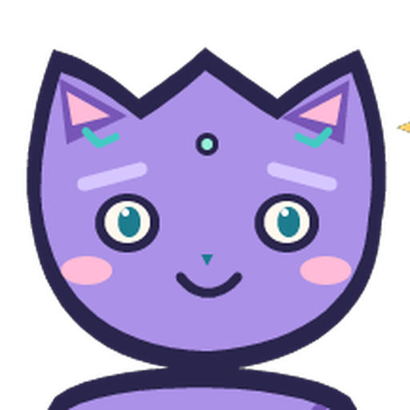

# Herdr 캐릭터

[English](readme.md)

이 공개 캐릭터 라이브러리에는 현재 코딩 캣, 아린, 루벨리아(교복), 루벨리아(수영복) 팩 기록 네 개가 표시됩니다. **갤러리에서 다운로드할 수 있는 팩은 코딩 캣뿐**이며 나머지는 다운로드가 없는 소스/연구 항목입니다. 코딩 캣은 Herdr Desktop Pet용 오리지널 MIT 라이선스 절차적 PNG 캐릭터 팩입니다. 캐릭터 포맷은 v4이고 투명한 384×512 PNG 프레임, 상태 클립 네 개(idle, running, waiting, unknown), 반응 클립 네 개(head tap, body tap, pet, completion observed)를 포함합니다. 팩과 출처 고지문은 [`packs/png-example`](packs/png-example), 재현 가능한 그림 생성 도구는 [`tools/generate-character.py`](tools/generate-character.py)에 있습니다. 저장소의 [MIT 라이선스](LICENSE.txt)는 오리지널 소스 도구와 예제 팩에 적용되며 별도 라이선스의 연구 작품에는 적용되지 않습니다.

## 캐릭터 미리보기

<table>
  <tr>
    <td align="center" width="180"><a href="previews/coding-cat-profile.png"></a><br><strong>코딩 캣</strong><br>선택 다운로드<br>MIT</td>
    <td align="center" width="180"><a href="previews/arin-research-profile.png"></a><br><strong>아린</strong><br>웹 갤러리 연구용 프로필<br>팩 릴리스 없음</td>
    <td align="center" width="180"><a href="packs/rubelia-school-uniform">루벨리아(교복)</a><br>갤러리 소스 전용 미리보기<br>갤러리 다운로드 없음</td>
    <td align="center" width="180"><a href="packs/rubelia-white-bikini">루벨리아(수영복)</a><br>갤러리 소스 전용 미리보기<br>갤러리 다운로드 없음</td>
  </tr>
</table>

코딩 캣은 다운로드할 수 있는 선택형 [MIT 라이선스 팩](packs/png-example/SOURCE.txt)입니다. 아린은 웹 갤러리에서 “Arin” 또는 “아린”으로 검색할 수 있으며 프로필과 PSD를 포함한 [저장소의 연구용 소스](packs/arin-research)를 볼 수 있습니다. 아린의 공식 아카이브·카탈로그 다운로드·설치형 릴리스는 없으며, 아린 작품에는 별도의 [연구용 이용 조건](packs/arin-research/LICENSE.txt)이 적용됩니다. 기록된 [소유자 승인](packs/arin-research/owner-approval.json)은 공개 README 프로필 표시와 저장소 소스 공개에 관한 것이며, 이번 갤러리 연구 항목 등록 요청은 그 승인과 별개로 권한을 확대하지 않습니다.

## 웹 갤러리 둘러보기

[갤러리 소스](index.html)는 모든 `packs/*/manifest.json`에서 카탈로그와 정렬된 히어로 카드를 만듭니다. 현재 코딩 캣, 아린, 루벨리아(교복), 루벨리아(수영복)가 표시됩니다. 새 소스 팩은 [`catalog.source.json`](catalog.source.json)에 수동 등록하지 않아도 다음 빌드 또는 `main` 푸시 때 나타납니다. 해당 파일은 팩 목록이 아닌 저작된 프로필·게시 정보 재정의 및 기존 코딩 캣 고정 릴리스 정보에 사용합니다. 원본 네 포즈 [`sources/legacy-png`](sources/legacy-png) 예제는 코딩 캣의 소스 자료이지 별도 캐릭터나 설치형 팩이 아닙니다. 검색은 이름(한글 포함), 태그, 설명, 변형 이름에 적용되며 전체(All)·Rig·PNG·연구(Research) 필터와 함께 사용할 수 있습니다. PNG에는 코딩 캣, 연구에는 아린과 루벨리아 두 항목이 표시됩니다. 게시 날짜가 기록되어 있으면 최신순 정렬에 사용하며 알 수 없는 날짜는 만들어 넣지 않습니다. 이름순은 선택한 언어의 정렬 규칙을 사용합니다. 연구/소스 항목은 저장소 소스와 이용 조건으로 연결되며 갤러리 다운로드를 제공하지 않습니다.

저장소 루트에서 로컬로 미리 보려면 이미지 의존성을 설치하고 이미 게시된 코딩 캣 아카이브를 가져온 다음 manifest에서 정적 사이트를 만들고 서버를 실행하세요.

```sh
python3 -m pip install -r requirements-gallery.txt
python3 scripts/fetch-downloads.py
python3 scripts/build-gallery.py
npm run preview
```

`http://127.0.0.1:4187/`을 여세요. fetch는 Python 표준 라이브러리만 사용하며 `catalog.json`에 기록된 코딩 캣 고정 릴리스 아카이브만 검증합니다. 갤러리 빌드는 Pillow로 소스 미리보기를 만들고 `dist/gallery`를 생성합니다. 두 명령 모두 네이티브 실행 파일이 필요하지 않습니다. 아래의 네이티브 저작 명령은 별도로 카탈로그·패키지·미리보기를 다시 생성하며 Pages CI에서는 실행하지 않습니다. 갤러리는 좁은 모바일 화면을 지원하며 카탈로그 로드 실패 후 언어를 전환해도 오류 설명과 재시도(Retry) 동작을 유지합니다.

## GitHub Pages에 게시하기

공개 갤러리 주소는 **[https://hanbong5938.github.io/herdr-characters/](https://hanbong5938.github.io/herdr-characters/)**입니다. GitHub Pages는 **Settings → Pages → Build and deployment → Source: GitHub Actions**와 `main`용 `github-pages` 환경을 사용합니다. `main`에 푸시하거나 **Actions → Deploy gallery to GitHub Pages → Run workflow**에서 수동 실행하면 고정 갤러리 의존성을 설치하고 게시된 코딩 캣 아카이브를 가져와 검증한 뒤 모든 현재 팩 manifest를 발견하여 `dist/gallery`만 배포합니다. 소스 항목의 미리보기와 저장소 링크는 설치형 아카이브를 게시하거나 이용 권한을 변경하지 않습니다. 워크플로의 `page_url`에서 배포 주소를 확인할 수 있습니다.

## 루벨리아 복장 소스

교복·수영복의 현재 원본 팩은 비공개 보관소에서 이 공통 저장소로 이동했습니다. 원화·10포즈 PSD·리깅·모션은 그대로이며, 이름과 저장소 소스 공개 범위만 갱신했습니다.

| 한국어 이름 | 영어 표시 | 원본 팩 |
| --- | --- | --- |
| 루벨리아(교복) | Rubelia (School Uniform) | [`packs/rubelia-school-uniform`](packs/rubelia-school-uniform) |
| 루벨리아(수영복) | Rubelia (Swimsuit) | [`packs/rubelia-white-bikini`](packs/rubelia-white-bikini) |

사용자는 두 팩을 공개 저장소 소스로 포함하는 범위를 선택했습니다. 각 팩의 `owner-approval.json`에 이 사용자 진술을 기록하며, 독립적인 권리 검증이나 새 모델 라이선스를 뜻하지 않습니다. 원본·Qwen 이용 조건은 각 팩의 `NOTICE.txt`, `LICENSE.txt`, `QWEN_RESEARCH_LICENSE.txt`를 따릅니다. 당시 이동으로 commit·push·공식 패키지 릴리스를 수행하지 않았으며 루벨리아 다운로드를 추가하지 않았습니다. 현재 갤러리에는 두 팩이 다운로드 불가능한 소스 항목으로 표시됩니다.

비공개 로컬 갤러리는 같은 원본을 참조해 위 한·영 이름을 표시합니다. 앱에 설치되는 manifest 이름은 한국어 단일 문자열이며 앱 언어에 따른 자동 이름 전환은 지원하지 않습니다.


## 루벨리아 복장 소스

교복·수영복의 현재 원본 팩은 비공개 보관소에서 이 공통 저장소로 이동했습니다. 원화·10포즈 PSD·리깅·모션은 그대로이며, 이름과 저장소 소스 공개 범위만 갱신했습니다.

| 한국어 이름 | 영어 표시 | 원본 팩 |
| --- | --- | --- |
| 루벨리아(교복) | Rubelia (School Uniform) | [`packs/rubelia-school-uniform`](packs/rubelia-school-uniform) |
| 루벨리아(수영복) | Rubelia (Swimsuit) | [`packs/rubelia-white-bikini`](packs/rubelia-white-bikini) |

사용자는 두 팩을 공개 저장소 소스로 포함하는 범위를 선택했습니다. 각 팩의 `owner-approval.json`에 이 사용자 진술을 기록하며, 독립적인 권리 검증이나 새 모델 라이선스를 뜻하지 않습니다. 원본·Qwen 이용 조건은 각 팩의 `NOTICE.txt`, `LICENSE.txt`, `QWEN_RESEARCH_LICENSE.txt`를 따릅니다. 이번 이동으로 commit·push·공식 패키지 릴리스를 수행하지 않았으며, 공개 다운로드 카탈로그에는 추가하지 않았습니다.

비공개 로컬 갤러리는 같은 원본을 참조해 위 한·영 이름을 표시합니다. 앱에 설치되는 manifest 이름은 한국어 단일 문자열이며 앱 언어에 따른 자동 이름 전환은 지원하지 않습니다.


## 다운로드 및 가져오기

공개 `packs-v0.0.2` 릴리스에서 [`coding-cat-v0.0.2.herdrchar`](https://github.com/hanbong5938/herdr-characters/releases/download/packs-v0.0.2/coding-cat-v0.0.2.herdrchar)와 [`SHA256SUMS`](https://github.com/hanbong5938/herdr-characters/releases/download/packs-v0.0.2/SHA256SUMS)를 다운로드하세요. 다운로드한 파일이 있는 폴더에서 `shasum -a 256 -c SHA256SUMS`로 아카이브를 검증할 수 있습니다. 생성된 [`catalog.json`](catalog.json)에도 정확한 바이트 수와 SHA-256 해시가 기록됩니다. 이 문서에 임의의 해시값을 사용하지 않습니다.

Herdr Desktop Pet 네이티브 실행 파일로 아카이브를 가져온 **다음 별도로 선택**하세요. 가져오기만 해서는 활성화되지 않습니다.

```sh
PET="/path/to/herdr-desktop-pet"
"$PET" pack import --path "/absolute/path/to/coding-cat-v0.0.2.herdrchar"
"$PET" pack select coding-cat
```

`PET`와 아카이브 경로를 실제 로컬 경로로 바꾸세요. 또는 앱의 **캐릭터** 탭에서 아카이브를 가져오고 코딩 캣을 선택한 뒤 **적용**을 누르세요.

## 소스 예제 다시 생성하기

오리지널 도구 두 개는 Python 표준 라이브러리만 사용하며 외부 에셋 서비스나 타사 그림이 필요하지 않습니다. 이 저장소의 루트에서 실행하세요.

```sh
python3 tools/generate-character.py --output sources/legacy-png
python3 tools/generate-character-examples.py --output packs/png-example --replace
```

첫 번째 명령은 원본 네 포즈 레거시 래스터 예제를, 두 번째 명령은 그림 생성 도구를 이용한 v4 코딩 캣 예제 팩을 다시 만듭니다. 기존 `packs/png-example` 폴더를 교체하려면 `--replace`가 필요합니다. 보존해야 할 로컬 변경 사항이 있다면 실행하지 마세요.

## 카탈로그와 갤러리 빌드

코딩 캣 예제를 패키징·검증하고 네이티브 갤러리 미리보기를 렌더링하려면 Herdr 네이티브 실행 파일과 `tools/character-pack.py`가 있는 Herdr Desktop Pet 소스 체크아웃을 제공하세요. 소스 미리보기 생성을 위해 Pillow를 설치하세요.

```sh
python3 -m pip install -r requirements-gallery.txt
python3 scripts/build-catalog.py --native /absolute/path/to/herdr-desktop-pet --app-source /absolute/path/to/herdr-pet
python3 scripts/build-gallery.py
```

두 빌더 모두 `packs/*/manifest.json`을 발견하여 소스 전용 카탈로그 항목과 미리보기를 자동 재생성합니다. [`catalog.source.json`](catalog.source.json)은 필수 소스 팩 목록이 아니라 저작된 프로필·게시 정보 재정의와 고정 릴리스 데이터를 담습니다. `build-catalog.py`는 `catalog.json`, 코딩 캣 아카이브와 체크섬, 네이티브 코딩 캣 미리보기를 재생성합니다. `build-gallery.py`는 현재 네 항목을 포함한 카탈로그를 `dist/gallery`에 다시 생성합니다. 갤러리 다운로드가 고정된 항목은 코딩 캣뿐이며 `python3 scripts/fetch-downloads.py`도 해당 아카이브만 가져옵니다. 소스 전용 항목에는 variants나 갤러리 다운로드가 없습니다. 투명 미리보기는 선언된 PNG idle 이미지 또는 Pillow가 읽은 저작 원본 PSD의 병합 합성 이미지에서 생성되며 네이티브 애니메이션 렌더나 호환성 증명이 아닙니다. 아린·루벨리아의 설치형 릴리스를 자동 생성하지 않습니다.

저장소의 독립 프로필 이미지에는 코딩 캣의 기존 기본 idle 이미지로 만든 [`previews/coding-cat-profile.png`](previews/coding-cat-profile.png)와 아린의 네이티브 waiting 렌더에서 잘라낸 [`previews/arin-research-profile.png`](previews/arin-research-profile.png)가 있습니다(출처 기록: [`packs/arin-research/source-record.json`](packs/arin-research/source-record.json)). 소유자가 진술한 공개 README 프로필 표시 및 저장소 소스 공개 승인과 날짜는 [`packs/arin-research/owner-approval.json`](packs/arin-research/owner-approval.json)에 기록됩니다. 이 진술은 독립적으로 확인된 법적 허가가 아니며 공식 패키지 릴리스, 상업적 사용, 모델 자료의 이용권이나 네이티브 앱 카탈로그·캐릭터 메뉴 등록을 허용하지 않습니다. 이번 요청에 따른 웹 갤러리의 연구 항목 등록은 네이티브 앱 메뉴 등록이나 설치 지원을 추가하지 않습니다. 카탈로그를 다시 생성해도 프로필 PNG와 아린의 연구 항목은 보존되며 생성된 카탈로그와 갤러리에 표시됩니다.
