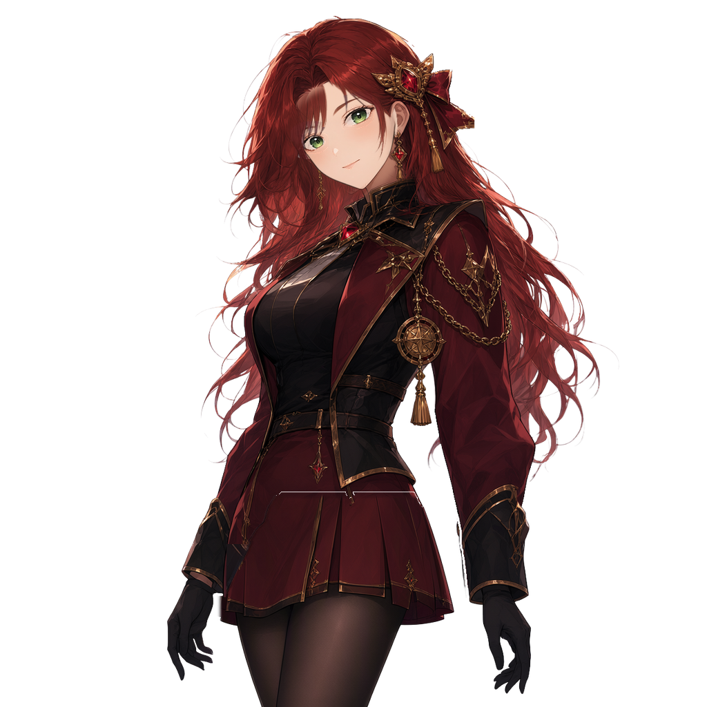

# Herdr 캐릭터

[English](readme.md)

**네이티브 검증을 마친 `packs-v0.0.6` 카탈로그**에는 새 **채린 0.0.6**과 기존 코딩 캣·아린·루벨리아 세 팩, 총 **여섯 다운로드 팩**이 포함됩니다. 기존 다섯 팩의 버전과 아카이브 바이트는 유지합니다. 채린의 좌우 눈 소유 영역 클리핑에는 **Herdr Desktop Pet v0.3.4 이상**이 필요하고, 기존 다섯 팩은 **v0.2.1 이상**을 유지합니다. 코딩 캣은 오리지널 MIT 라이선스 PNG 팩(v4), 나머지 다섯 팩은 독립 포즈 10개를 가진 rig 팩(v5)이며 작품 이용 조건은 별개입니다. 저장소 [MIT 라이선스](LICENSE.txt)는 작품을 재라이선스하지 않습니다. 공개 게시·다운로드 가능 여부는 비초안 릴리스에서 확인하세요. 소스 메타데이터만으로 공개 업로드를 증명하지 않습니다.

## 캐릭터 미리보기

<table>
  <tr>
    <td align="center" width="180"><a href="previews/coding-cat-profile.png"></a><br><strong>코딩 캣</strong><br>선택 다운로드<br>MIT</td>
    <td align="center" width="180"><a href="previews/arin-research-profile.png"></a><br><strong>아린</strong><br>다운로드 가능한 rig 팩<br>별도 작품 이용 조건</td>
    <td align="center" width="180"><a href="previews/chaerin-research-profile.png"></a><br><strong>채린</strong><br>0.0.6 · 앱 v0.3.4+<br>별도 작품/모델 이용 조건</td>
    <td align="center" width="180"><a href="previews/rubelia-school-uniform-idle.png"></a><br><strong>루벨리아(교복)</strong><br>다운로드 가능한 rig 팩</td>
    <td align="center" width="180"><a href="previews/rubelia-white-bikini-idle.png"></a><br><strong>루벨리아(수영복)</strong><br>다운로드 가능한 rig 팩</td>
    <td align="center" width="180"><a href="previews/rubelia-burgundy-uniform-idle.png"></a><br><strong>루벨리아(제복)</strong><br>B 짧은 플리츠 · 0.0.5</td>
  </tr>
</table>

아린·채린·루벨리아 복장 팩은 [`shared-world-canon`](https://github.com/hanbong5938/shared-world-canon) 원본 해시와 소유자 기록을 포함한 출처 정보를 유지합니다. 채린 원본·얼굴 참조의 공개 재배포 권한에 대한 사용자 진술 및 다운로드/설치형 팩·PSD 소스 10개·갤러리 게시의 **2026-10-09 별도 명시적 승인**은 [소유자 승인 기록](packs/chaerin-research/owner-approval.json)에 있습니다. 이전 비공개 편집 승인만으로 공개를 허가하지 않았습니다. 독립적인 법적·모델 자료 권리 검증이나 이후 상업 이용·제3자 재허락은 부여하지 않으며 원본 레지스트리의 commercial-blocked 상태는 그대로입니다. 팩의 라이선스·저작자·출처 고지문을 아카이브와 함께 보존하세요.

## 웹 갤러리 둘러보기

[갤러리](https://hanbong5938.github.io/herdr-characters/)는 모든 `packs/*/manifest.json`을 발견하며 [`catalog.source.json`](catalog.source.json)이 프로필과 명시적인 게시 정보를 제공합니다. 네이티브 검증한 카탈로그에는 다운로드 가능한 여섯 항목이 있습니다. **Rig**에는 채린·아린·루벨리아 세 팩, **PNG**에는 코딩 캣이 표시됩니다. **연구(Research)**는 소스 전용 항목용이며 현재 해당 항목은 없습니다. 선택적인 `displayName`과 라이선스 `displayLabel` 메타데이터는 현재 언어, 영어, 기존 단일 문자열 순으로 표시합니다. 이름과 영어·한국어 표시 이름, 태그·설명·변형 이름 검색 및 정렬도 현재 언어를 따릅니다. 갤러리는 게시된 [`catalog.json`](catalog.json)을 읽으므로 네이티브 패키징 후 원본에서 카탈로그를 재생성하고 배포해야 실제 갤러리에 반영됩니다. 자동 소스 발견은 공개 릴리스 승인이 아닙니다. [`sources/legacy-png`](sources/legacy-png)는 코딩 캣 소스이지 추가 팩이 아닙니다.

로컬 미리보기를 위해 이미지 의존성을 설치하고 고정 릴리스의 여섯 아카이브를 가져온 다음 정적 사이트를 빌드해 실행하세요.

```sh
python3 -m pip install -r requirements-gallery.txt
python3 scripts/fetch-downloads.py
python3 scripts/build-gallery.py
npm run preview
```

`http://127.0.0.1:4187/`을 여세요. fetch는 Python 표준 라이브러리로 모든 고정 아카이브의 바이트 수와 SHA-256을 `catalog.json`과 대조합니다. 갤러리 빌드는 `dist/gallery`를 생성하며 두 명령 모두 네이티브 앱이 필요하지 않습니다. 아래 네이티브 저작 명령이 아카이브·애니메이션 미리보기를 재생성하고 Pages CI는 이미 게시된 릴리스만 가져옵니다. 갤러리는 좁은 모바일 화면과 카탈로그 오류 후 언어 전환 시 오류·재시도 상태 유지를 지원합니다.

## GitHub Pages에 게시하기

공개 갤러리는 **[https://hanbong5938.github.io/herdr-characters/](https://hanbong5938.github.io/herdr-characters/)**입니다. GitHub Pages는 **GitHub Actions**와 `github-pages` 환경을 사용합니다. **재생성한 카탈로그를 `main`에 푸시하기 전에 여섯 릴리스 파일을 모두 게시하세요.** Pages 워크플로는 모든 고정 아카이브를 검증하고 `dist/gallery`를 빌드·배포합니다. 소스 미리보기·저장소 링크만으로 설치형 배포가 완료되지 않습니다.

## 루벨리아 복장 소스

교복·수영복 소스는 비공개 보관소에서 이 공통 저장소로 이동했습니다. 원화·10포즈 PSD·리깅·모션은 그대로이며, 공개 승인·라이선스·출처 고지문에 소유자가 승인한 `packs-v0.0.3` 다운로드 범위를 기록했습니다.

| 한국어 이름 | 영어 표시 | 원본 팩 |
| --- | --- | --- |
| 루벨리아(교복) | Rubelia (School Uniform) | [`packs/rubelia-school-uniform`](packs/rubelia-school-uniform) |
| 루벨리아(수영복) | Rubelia (Swimsuit) | [`packs/rubelia-white-bikini`](packs/rubelia-white-bikini) |
| 루벨리아(제복) | Rubelia (Burgundy Uniform) | [`packs/rubelia-burgundy-uniform`](packs/rubelia-burgundy-uniform) |

과거 소스 전용 이동에서는 설치형 아카이브를 게시하지 않았습니다. 이후 사용자가 네 팩 전체의 다운로드 릴리스를 승인했으며 루벨리아 두 팩의 `owner-approval.json`에 이 별도 승인을 기록했습니다. `NOTICE.txt`, `LICENSE.txt`, `QWEN_RESEARCH_LICENSE.txt`에 원본·모델 출처를 보존하고 새 상업 이용 라이선스는 부여하지 않습니다.

갤러리는 같은 원본을 참조하며 현지화된 표시 이름은 설치되는 manifest 이름과 별개입니다. 앱에 설치되는 manifest 이름은 한국어 단일 문자열이며 앱 언어에 따른 자동 이름 전환은 지원하지 않습니다.

## 다운로드 및 가져오기

비초안 [`packs-v0.0.6`](https://github.com/hanbong5938/herdr-characters/releases/tag/packs-v0.0.6)에서 여섯 아카이브와 [`SHA256SUMS`](https://github.com/hanbong5938/herdr-characters/releases/download/packs-v0.0.6/SHA256SUMS)를 받으세요. 채린만 새 아카이브이며 기존 다섯 팩의 버전·바이트는 변하지 않습니다. 이전 `packs-v0.0.5` 등은 유지합니다.

| 캐릭터 | 아카이브 | 선택 ID |
| --- | --- | --- |
| 코딩 캣 | [coding-cat-v0.0.3.herdrchar](https://github.com/hanbong5938/herdr-characters/releases/download/packs-v0.0.6/coding-cat-v0.0.3.herdrchar) | `coding-cat` |
| 아린 | [arin-research-v0.0.4.herdrchar](https://github.com/hanbong5938/herdr-characters/releases/download/packs-v0.0.6/arin-research-v0.0.4.herdrchar) | `arin-research` |
| 채린 (앱 v0.3.4+) | [chaerin-research-v0.0.6.herdrchar](https://github.com/hanbong5938/herdr-characters/releases/download/packs-v0.0.6/chaerin-research-v0.0.6.herdrchar) | `chaerin-research` |
| 루벨리아(교복) | [rubelia-school-uniform-v0.0.3.herdrchar](https://github.com/hanbong5938/herdr-characters/releases/download/packs-v0.0.6/rubelia-school-uniform-v0.0.3.herdrchar) | `rubelia-school-uniform` |
| 루벨리아(수영복) | [rubelia-white-bikini-v0.0.3.herdrchar](https://github.com/hanbong5938/herdr-characters/releases/download/packs-v0.0.6/rubelia-white-bikini-v0.0.3.herdrchar) | `rubelia-white-bikini` |
| 루벨리아(제복) | [rubelia-burgundy-uniform-v0.0.5.herdrchar](https://github.com/hanbong5938/herdr-characters/releases/download/packs-v0.0.6/rubelia-burgundy-uniform-v0.0.5.herdrchar) | `rubelia-burgundy-uniform` |

여섯 파일과 `SHA256SUMS`를 같은 폴더에 내려받아 `shasum -a 256 -c SHA256SUMS`로 검증하세요. 재생성된 [`catalog.json`](catalog.json)에 각 아카이브의 정확한 바이트 수와 SHA-256이 기록됩니다.

채린은 [v0.3.4 앱](https://github.com/hanbong5938/herdr-desktop-pet/releases/tag/v0.3.4) 이상, 기존 다섯 팩은 v0.2.1 이상으로 가져온 **다음 별도로 선택**하세요. 가져오기만 해서는 활성화되지 않습니다.

```sh
PET="/path/to/herdr-desktop-pet"
"$PET" pack import --path "/absolute/path/to/chaerin-research-v0.0.6.herdrchar"
"$PET" pack select chaerin-research
```

`PET`와 아카이브 경로를 실제 로컬 경로로 바꾸거나 앱의 **캐릭터** 탭에서 가져온 뒤 선택한 캐릭터를 **적용**하세요. 다른 팩은 위 표의 선택 ID를 사용합니다. 가져오기는 사용자 선택이며 내장 기본 캐릭터를 교체하지 않습니다.

## 소스 예제 다시 생성하기

오리지널 도구 두 개는 Python 표준 라이브러리만 사용하며 외부 에셋 서비스나 타사 그림이 필요하지 않습니다. 이 저장소의 루트에서 실행하세요.

```sh
python3 tools/generate-character.py --output sources/legacy-png
python3 tools/generate-character-examples.py --output packs/png-example --replace
```

첫 번째 명령은 원본 네 포즈 레거시 래스터 예제를, 두 번째 명령은 그림 생성 도구를 이용한 v4 코딩 캣 예제 팩을 다시 만듭니다. 기존 `packs/png-example` 폴더를 교체하려면 `--replace`가 필요합니다. 보존해야 할 로컬 변경 사항이 있다면 실행하지 마세요.

## 카탈로그와 갤러리 빌드

여섯 팩을 모두 패키징·검증하고 네이티브 미리보기를 렌더링하려면 **Herdr Desktop Pet v0.3.4 이상**과 `tools/character-pack.py`가 있는 소스 체크아웃을 제공하세요. 기존 다섯 팩의 최소 버전은 그대로지만 이전 앱은 채린 눈 클리핑 호환성을 증명하지 않습니다. 갤러리 이미지 의존성을 설치하세요.

```sh
python3 -m pip install -r requirements-gallery.txt
python3 scripts/build-catalog.py --native /absolute/path/to/herdr-desktop-pet --app-source /absolute/path/to/herdr-pet
python3 scripts/build-gallery.py
```

두 빌더 모두 `packs/*/manifest.json`을 발견합니다. `build-catalog.py`는 `catalog.source.json`에 명시적으로 게시한 모든 변형을 패키징하고, 소스와 아카이브를 네이티브 검증한 뒤 팩마다 미리보기 다섯 장(채린: `chaerin-research-idle.png`, `chaerin-research-running-0.png`부터 `-3.png`)을 렌더링합니다. 모든 팩이 성공한 뒤에만 `catalog.json`과 `SHA256SUMS`를 갱신합니다. `build-gallery.py`는 다운로드·이용 고지를 배치하고 `fetch-downloads.py`는 아카이브 크기·해시를 확인합니다. 신규 소스 전용 팩에는 별도 승인·등록 전까지 아카이브가 없으며 Pillow 합성 미리보기는 네이티브 호환성 증명이 아닙니다.

기존 [`previews/coding-cat-profile.png`](previews/coding-cat-profile.png)와 [`previews/arin-research-profile.png`](previews/arin-research-profile.png)는 카탈로그 재생성 중 보존합니다. 채린의 [네이티브 프로필](previews/chaerin-research-profile.png)은 실제 v0.3.4 [waiting idle 미리보기](previews/chaerin-research-idle.png), SHA-256 `598c5a0feaf36312e2550a338ea16ebe3d36ce57ea30e1baa903c6e18268f56f`에서 `[300, 0, 790, 445]`를 잘라 LANCZOS로 512×512 RGBA로 만든 결과이며 SHA-256은 `34cb9ce0008f6436f9be406cc1e7cdbe046044de305a1d93d8f33c9db6b88dc4`입니다. 직접 시각 검토했고 덧칠·추가 생성은 없습니다. 패키징한 최신 ABI SDK 검수는 실제 233프레임(10모델 진입·동일 컨텍스트 재진입 3개·원본 모션 80개·분리된 눈/입/머리 제어 140개)을 포함합니다. PSD·오버라이드·모션·rig entry 31개는 승인한 production 원본과 바이트 단위로 일치하며 진단 모션 복사본은 배포하지 않습니다. [출처](packs/chaerin-research/source-record.json)·[소유자 승인](packs/chaerin-research/owner-approval.json)·[QA 정책](packs/chaerin-research/qa-release-policy.json)은 과거 비공개 검수와 새 공개 범위를 구분합니다. cancelled/disconnected의 과거 흰색 눈 이상 원인은 미확인 상태이며 별개의 좌우 홍채 소유 영역·흰자 후반 순서 회귀는 수정 전 실패하고 v0.3.4 후보의 실제 Metal 다섯 fixture에서 통과했습니다. 새 상업 이용·제3자 재허락·모델 자료 이용권은 부여하지 않습니다.

**제복 0.0.5**는 승인된 B 짧은 플리츠를 독립 포즈 10개에 적용하고 기존 얼굴·원안 귀걸이·모션을 유지합니다. 실제 native 71개 캡처를 밝고 어두운 배경에서 검토했으며 10포즈 얼굴·귀걸이 영역의 원본 픽셀 일치를 확인했습니다. 소유자가 원안·얼굴 참조의 공개 재배포 권한과 이번 소스·카탈로그·설치형 릴리스를 별도로 확인했습니다([소유자 승인](packs/rubelia-burgundy-uniform/owner-approval.json)). 과거 로컬 전용 고지는 역사적 기록으로 구분합니다. 비공개 실행 감사·작업 이미지는 패키지에 포함하지 않으며 해시와 현재 제작 경로는 [출처 기록](packs/rubelia-burgundy-uniform/source-record.json)에 보존합니다. 새 상업 이용·모델 자료 라이선스는 부여하지 않습니다.

아린 **0.0.4**에는 원본 초상화를 기준으로 수정한 얼굴이 독립 native 모델 10개 모두에 포함됩니다. 기존 비얼굴 원화와 포즈별 모션 8개는 유지합니다. 사용자가 2026-10-09 공식 배포를 별도로 요청했으며 [소유자 승인](packs/arin-research/owner-approval.json)과 [출처 기록](packs/arin-research/source-record.json)은 그 승인과 운영자의 시각 검토를 구분합니다. 독립 프로필은 waiting idle t0 네이티브 캡처 SHA-256 `d754457b44e4bc087da1e7750322e38dc57e6042fb99ed751fa26196d2e35012`에서 `[300, 0, 720, 420]`을 잘라 LANCZOS로 512×512 RGBA 크기로 만든 결과이며 SHA-256은 `b77249f42f0b094f8284e50707ec0a61c1fb7c7235d7b9b486d5e90d7ed58d35`입니다. 카탈로그의 아린 대기·작업 미리보기도 수정된 production 모델로 재생성합니다. 과거 `packs-v0.0.3` 아카이브는 덮어쓰지 않으며 StageR3/91d756 기록은 현재 얼굴 일치성의 근거가 아닙니다. 이번 배포는 새 상업 이용·모델 자료 이용권을 부여하지 않습니다.
