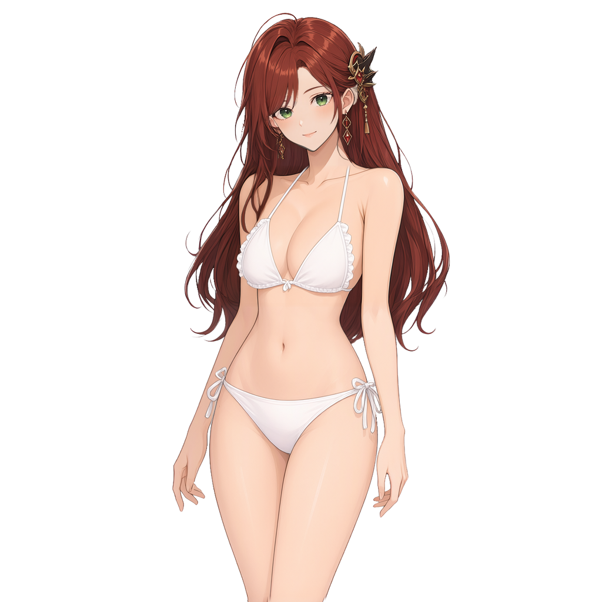

# Herdr characters

[한국어](readme.ko.md)

This public character library provides **four downloadable packs in `packs-v0.0.4`**: corrected Arin **0.0.4**, Coding Cat, Rubelia (School Uniform), and Rubelia (Swimsuit). The other three packs retain their **0.0.3** versions and unchanged archives. Use **Herdr Desktop Pet v0.2.1 or newer**; v0.2.0 cannot resolve Arin's reference-only mesh layers. Coding Cat is an original MIT-licensed procedural PNG pack with transparent 384×512 frames, four phase clips and four reaction clips (format v4). The other three are independent ten-pose rig packs (format v5) with separately recorded artwork terms. The repository [MIT license](LICENSE.txt) does not relicense their artwork.

## Character previews

<table>
  <tr>
    <td align="center" width="180"><a href="previews/coding-cat-profile.png"></a><br><strong>Coding Cat</strong><br>Optional download<br>MIT</td>
    <td align="center" width="180"><a href="previews/arin-research-profile.png"></a><br><strong>Arin</strong><br>Downloadable rig pack<br>Separate artwork terms</td>
    <td align="center" width="180"><a href="previews/rubelia-school-uniform-idle.png"></a><br><strong>Rubelia (School Uniform)</strong><br>Downloadable rig pack</td>
    <td align="center" width="180"><a href="previews/rubelia-white-bikini-idle.png"></a><br><strong>Rubelia (Swimsuit)</strong><br>Downloadable rig pack</td>
  </tr>
</table>

Arin and both Rubelia wardrobe packs retain provenance linked to [`shared-world-canon`](https://github.com/hanbong5938/shared-world-canon), including original-source hashes and owner records. The owner's separate approval for this public downloadable/installable release is recorded in each pack's `owner-approval.json`. It does not grant a new downstream commercial license, independently verified legal clearance, or model-material rights. Keep each pack's license, attribution and source notices with the archive.

## Browse the web gallery

The [gallery](https://hanbong5938.github.io/herdr-characters/) discovers every `packs/*/manifest.json`; [`catalog.source.json`](catalog.source.json) supplies authored profiles and explicit publication metadata. All four current entries are downloadable: **Rig** shows Arin and both Rubelia packs, **PNG** shows Coding Cat. **Research** is reserved for source-only entries and currently has none. Optional `displayName` and license `displayLabel` metadata localize gallery names and license summaries using the current language, then English, then the canonical scalar name or label. Search matches canonical and both English/Korean display names regardless of the selected language, plus tags, descriptions and variant names; alphabetic order and publication-date ties sort by the visible name in the current language. The gallery reads the published [`catalog.json`](catalog.json), so metadata-only changes must update both source and published catalogs; editing `catalog.source.json` alone does not change the gallery. Newly discovered sources are not automatically authorized or packaged for release. The original [`sources/legacy-png`](sources/legacy-png) fixture is Coding Cat source material, not a fifth pack.

For a local preview, install the gallery image dependency, fetch all four pinned release archives, build the static site and serve it:

```sh
python3 -m pip install -r requirements-gallery.txt
python3 scripts/fetch-downloads.py
python3 scripts/build-gallery.py
npm run preview
```

Open `http://127.0.0.1:4187/`. Fetch uses the Python standard library and checks every pinned archive's bytes and SHA-256 against `catalog.json`; the gallery build writes `dist/gallery`. Neither command needs the native app. Native authoring commands below regenerate the archives and animated previews; Pages CI only fetches the already published release. The gallery supports narrow mobile screens and retains its error/Retry state when switching languages after a catalog load failure.

## Publish with GitHub Pages

The public gallery is **[https://hanbong5938.github.io/herdr-characters/](https://hanbong5938.github.io/herdr-characters/)**. GitHub Pages uses **GitHub Actions** and the `github-pages` environment. Publish all release assets **before pushing the new catalog to `main`**: the Pages workflow fetches and verifies all four pinned archives, builds `dist/gallery`, and deploys that directory. A source-only preview or repository link does not authorize an installable release.

## Rubelia wardrobe sources

The school-uniform and swimsuit sources moved from the private archive into this shared repository. Original artwork, ten-pose PSDs, rigs and motion are unchanged; publication approval and license/provenance notices now record the owner-approved `packs-v0.0.3` downloads.

| Korean pack name | English display | Canonical source |
| --- | --- | --- |
| 루벨리아(교복) | Rubelia (School Uniform) | [`packs/rubelia-school-uniform`](packs/rubelia-school-uniform) |
| 루벨리아(수영복) | Rubelia (Swimsuit) | [`packs/rubelia-white-bikini`](packs/rubelia-white-bikini) |

The earlier source-only migration did not publish installable archives. The user subsequently approved publishing all four packs as downloads; both Rubelia `owner-approval.json` files record this separate authorization. Their `NOTICE.txt`, `LICENSE.txt` and `QWEN_RESEARCH_LICENSE.txt` preserve source and model provenance without granting a new downstream commercial license.

The gallery uses these same canonical sources and its localized display names are distinct from installed manifest names. Installed manifest names remain single Korean strings; automatic name switching with the app language is not supported.

## Download and import

Download the archives and [`SHA256SUMS`](https://github.com/hanbong5938/herdr-characters/releases/download/packs-v0.0.4/SHA256SUMS) from [`packs-v0.0.4`](https://github.com/hanbong5938/herdr-characters/releases/tag/packs-v0.0.4). This release contains the repaired Arin 0.0.4 and the unchanged three 0.0.3 archives. Historical `packs-v0.0.3` and Coding Cat-only `packs-v0.0.2` remain unchanged.

| Character | Archive | Selection ID |
| --- | --- | --- |
| Coding Cat | [coding-cat-v0.0.3.herdrchar](https://github.com/hanbong5938/herdr-characters/releases/download/packs-v0.0.4/coding-cat-v0.0.3.herdrchar) | `coding-cat` |
| Arin | [arin-research-v0.0.4.herdrchar](https://github.com/hanbong5938/herdr-characters/releases/download/packs-v0.0.4/arin-research-v0.0.4.herdrchar) | `arin-research` |
| Rubelia (School Uniform) | [rubelia-school-uniform-v0.0.3.herdrchar](https://github.com/hanbong5938/herdr-characters/releases/download/packs-v0.0.4/rubelia-school-uniform-v0.0.3.herdrchar) | `rubelia-school-uniform` |
| Rubelia (Swimsuit) | [rubelia-white-bikini-v0.0.3.herdrchar](https://github.com/hanbong5938/herdr-characters/releases/download/packs-v0.0.4/rubelia-white-bikini-v0.0.3.herdrchar) | `rubelia-white-bikini` |

Download all four files alongside `SHA256SUMS`, then run `shasum -a 256 -c SHA256SUMS`. [`catalog.json`](catalog.json) also records each archive's exact byte count and SHA-256.

Use the [v0.2.1 app release](https://github.com/hanbong5938/herdr-desktop-pet/releases/tag/v0.2.1) or newer. Import a downloaded archive, then **select it separately**; importing alone does not make it active:

```sh
PET="/path/to/herdr-desktop-pet"
"$PET" pack import --path "/absolute/path/to/arin-research-v0.0.4.herdrchar"
"$PET" pack select arin-research
```

Replace `PET` and the archive path with actual local paths, or use the app's Characters tab to import the archive and **Apply** the selected character. Use the selection ID above for another pack. The stable v0.2.1 app supports manual import; this release does not add `main`'s unreleased online character browser or replace the bundled default.

## Recreate the source fixture

The two original utilities use the Python standard library and require no asset service or third-party artwork. Run from this repository's root:

```sh
python3 tools/generate-character.py --output sources/legacy-png
python3 tools/generate-character-examples.py --output packs/png-example --replace
```

The first command recreates the original legacy four-pose raster fixture; the second recreates the v4 Coding Cat example pack from the drawing utility. `--replace` is required when `packs/png-example` already exists; do not use it on a pack with local modifications you want to keep.

## Build the catalog and gallery

To package and validate all four packs and render their native previews, supply Herdr Desktop Pet **v0.2.1 or newer** and a source checkout containing `tools/character-pack.py`. Install the gallery image dependency:

```sh
python3 -m pip install -r requirements-gallery.txt
python3 scripts/build-catalog.py --native /absolute/path/to/herdr-desktop-pet --app-source /absolute/path/to/herdr-pet
python3 scripts/build-gallery.py
```

Both builders discover `packs/*/manifest.json`. `build-catalog.py` packages every explicitly published variant in `catalog.source.json`, validates both source and exact archive with the native app, renders five native previews per pack, and regenerates `catalog.json` and `SHA256SUMS` only after all packs succeed. `build-gallery.py` stages all four current downloads and notices. `fetch-downloads.py` fetches every pinned archive and checks its bytes and hash. A newly discovered source-only pack still has no archive until separately authorized and registered; its Pillow composite preview is not native compatibility proof.

Curated [`previews/coding-cat-profile.png`](previews/coding-cat-profile.png) and [`previews/arin-research-profile.png`](previews/arin-research-profile.png) remain unchanged during regeneration. Arin's [source record](packs/arin-research/source-record.json) and [owner approvals](packs/arin-research/owner-approval.json) retain historical profile/source-only scopes separately from the subsequent public pack-release approval. This downloadable catalog does not add bundled characters or grant commercial/model-material rights.

Arin **0.0.4** includes the original-portrait face repair in all ten independent native models, with the existing body artwork and eight motion slots per pose preserved. The user separately authorized this official release on 2026-10-09; [owner approvals](packs/arin-research/owner-approval.json) and the [source record](packs/arin-research/source-record.json) distinguish that authorization from operator artistic review. The standalone profile is a waiting idle t0 native capture SHA-256 `d754457b44e4bc087da1e7750322e38dc57e6042fb99ed751fa26196d2e35012`, crop `[300, 0, 720, 420]` and 512×512 LANCZOS RGBA SHA-256 `b77249f42f0b094f8284e50707ec0a61c1fb7c7235d7b9b486d5e90d7ed58d35`. The catalog's Arin idle/running previews are regenerated from the repaired production model. Historical `packs-v0.0.3` archives are not overwritten, and StageR3/91d756 records are not current face-match evidence. This release grants no new commercial or model-material rights.

Coding Cat profile provenance: source [`previews/coding-cat-idle.png`](previews/coding-cat-idle.png), SHA-256 `35df3d4346005167b645e0997723ad2e59404729fc895518733fe83629aa286d` (384×512 RGBA); face-centered square crop `[84, 35, 300, 251]` in source pixels (left, top, right, bottom), resized with LANCZOS to 512×512 RGBA PNG. Output [`previews/coding-cat-profile.png`](previews/coding-cat-profile.png) has SHA-256 `aa75304d0c0e7d570dc39465ccec8fc7af369efbbff970119e15f228a900ea3a`. Source transparency is retained; no AI generation, retouching, or new background. Rights remain unchanged: original repository-authored artwork, MIT, as recorded in [`packs/png-example/SOURCE.txt`](packs/png-example/SOURCE.txt).
